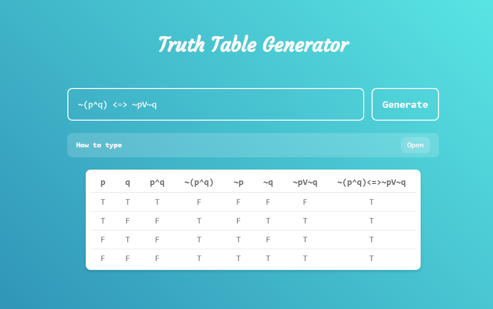

# Truth Table Generator
A simple step by step logical truth table generator.
Live at: https://trutabgen.com

## Usage
Input any logical formula using the following operators:

1. AND: ^
2. OR: V
3. NOT: ~
4. IMPLICATION: =>
5. EQUIVALENCE: <=>

Examples: ~(p^q) <=> ~pV~q
! Uppercase identifiers are not allowed: A, B..

